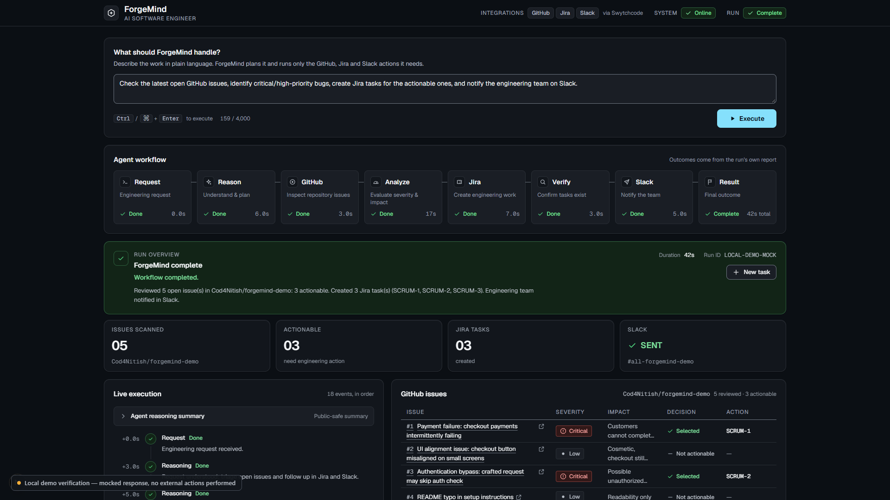
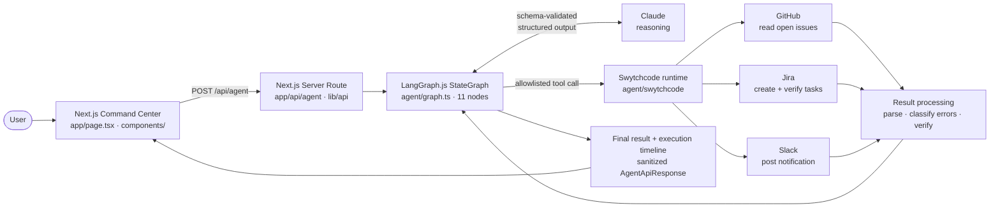
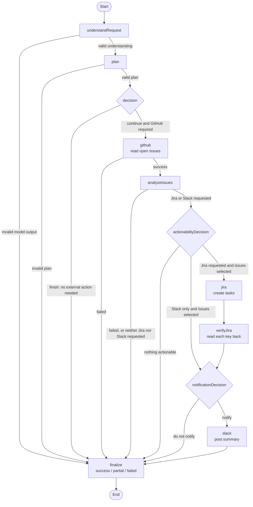
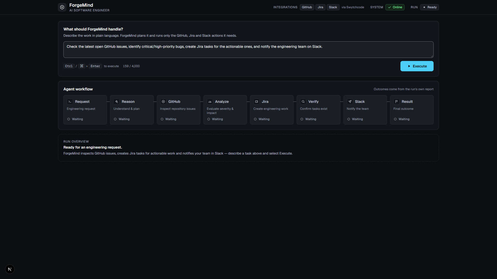
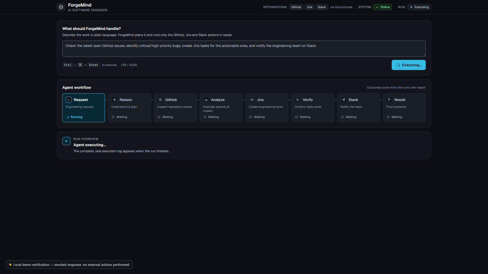
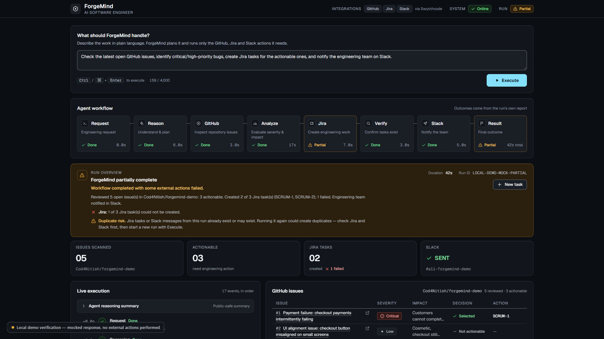
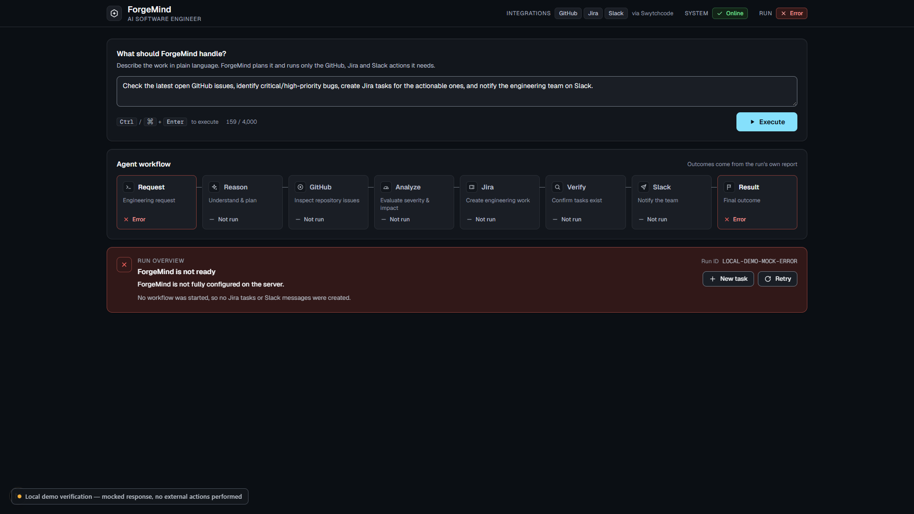
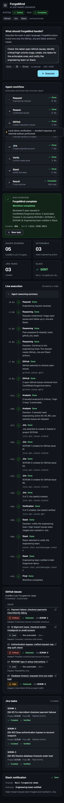

# ForgeMind

**An AI software engineer that turns a plain-language engineering request into real work across GitHub, Jira and Slack. It reasons with Claude, routes each step with LangGraph.js, and executes every external action through Swytchcode.**

Built for **Build with Swytchcode, Gurgaon Edition**, Track 1: AI Software Engineer.

    



<sub>Screenshot of the real Command Center UI rendering a **mocked** API response. Local demo verification only: no external actions were performed. See [Demo](#19-demo).</sub>

---

## Contents

1. [Overview](#1-overview)
2. [Problem](#2-problem)
3. [Solution](#3-solution)
4. [Why Agentic](#4-why-agentic)
5. [Core Workflow](#5-core-workflow)
6. [Architecture](#6-architecture)
7. [Decision Engine](#7-decision-engine)
8. [Swytchcode Integrations](#8-swytchcode-integrations)
9. [Tech Stack](#9-tech-stack)
10. [Demo Workflow](#10-demo-workflow)
11. [Example Input](#11-example-input)
12. [Example Output](#12-example-output)
13. [Project Structure](#13-project-structure)
14. [Setup](#14-setup)
15. [Environment Variables](#15-environment-variables)
16. [Local Development](#16-local-development)
17. [Testing](#17-testing)
18. [Security](#18-security)
19. [Demo](#19-demo)
20. [Deployment](#20-deployment)
21. [Future Scope](#21-future-scope)

---

## 1. Overview

ForgeMind is a web **Command Center** plus a server-side **agent**. An engineer types a request such as *"check the open GitHub issues, create Jira tasks for the critical bugs and tell the team on Slack"*. ForgeMind then:

- **understands** what the request asks for, and what it does not;
- **plans** which systems it actually needs;
- **reads** open GitHub issues through Swytchcode;
- **assesses** each issue's severity, impact and actionability with Claude;
- **decides** which issues need engineering work;
- **creates** Jira tasks only for those issues, then **reads each one back** to verify it exists;
- **decides** whether the team should be notified, and posts a factual Slack summary;
- **reports** an honest `success`, `partial` or `failed` result with a step-by-step execution timeline.

Every external call goes through Swytchcode. The browser never talks to GitHub, Jira, Slack or the model directly.

## 2. Problem

Engineering triage is repetitive glue work. Someone has to:

- read a stream of new issues;
- judge which are real bugs and how severe they are;
- copy the important ones into the team's tracker, with a priority and acceptance criteria;
- tell the team what changed.

Each hop means another tool, another tab and another chance to drop a critical bug or duplicate a ticket. Plain automation (a webhook that turns every issue into a ticket) can't make judgement calls. A chat assistant can make judgement calls but can't act. And an unconstrained agent that can act everywhere is a security risk.

## 3. Solution

ForgeMind splits the job into three layers, each doing only what it is good at:

| Layer | Role in ForgeMind |
| --- | --- |
| **Claude** | *Reasoning.* Understands the request, plans, assesses issues and makes each go/no-go decision. It returns **structured output that is schema-validated before it can influence anything**. |
| **LangGraph.js** | *Orchestration and routing.* An 11-node state graph with conditional edges. Tool results and validated decisions choose the next node; a failed stage always routes to finalize. |
| **Swytchcode** | *Execution.* The only path to GitHub, Jira and Slack. It uses a fixed allowlist of four canonical tools. Provider credentials live in Swytchcode's credential store, and ForgeMind's code never reads them. |

The **Next.js Command Center** shows the plan, each decision, every tool call and the final outcome as a live timeline. Partial failures are reported as partial and are never rounded up to success.

## 4. Why Agentic

ForgeMind is **not a fixed chain** of "fetch → create → post". The path through the graph is decided at run time:

- **The request decides the tools.** "Just summarise the open issues" never touches Jira or Slack. "Notify the team about critical bugs" skips Jira but can still post to Slack.
- **The model can decide to stop.** If the request needs no external action, the decision node routes straight to `finalize`.
- **Tool results decide the route.** If GitHub fails, analysis never runs and nothing downstream is attempted.
- **Findings decide the follow-up.** If no issue is actionable, no Jira task is created and no notification is forced.
- **Actions are verified.** Every created Jira task is read back (`verifyJira`) before it is reported as created.
- **Notifications are grounded.** The Slack summary is rejected if it mentions a Jira key that wasn't created or an issue that wasn't selected.

> **Claude reasons. LangGraph routes. Swytchcode executes.** No layer does another layer's job. That separation lets the agent act on real systems while staying auditable and safe.

## 5. Core Workflow

1. **Request.** The user submits a request (at most 4,000 characters) from the Command Center.
2. **Understand.** Claude extracts the intent and the requested actions (structured, validated).
3. **Plan.** Claude produces a short plan and a `requiredTools` map `{ github, jira, slack }`.
4. **Decide.** Claude picks `continue` or `finish`. `continue` proceeds only if GitHub is required.
5. **GitHub.** Swytchcode `github.issue.get1` reads the open issues of the **server-configured** repository.
6. **Analyze.** Claude assesses every issue (severity, impact, actionable, recommended action). Issue text is wrapped as untrusted data.
7. **Actionability.** Claude selects the issues that need work. Only issues assessed as actionable can be selected.
8. **Jira.** For each selected issue, Swytchcode `jira.api.issue.create` creates a task (priority and acceptance criteria included).
9. **Verify.** Swytchcode `jira.api.issue.get` reads each task key back.
10. **Notify decision.** Claude decides whether to notify the team, and the summary is checked against the actual results.
11. **Slack.** Swytchcode `slack.chat.postmessage.create` posts to the **server-configured** channel.
12. **Finalize.** A deterministic summarizer computes `success`, `partial` or `failed` from the recorded state, and the UI renders the timeline.

## 6. Architecture



- **Trust boundary 1 (HTTP).** `POST /api/agent` accepts only `{ "message": string }` (or the alias `prompt`). Unknown fields are rejected, so the browser can't choose the repository, channel, model or tools.
- **Trust boundary 2 (tools).** The graph can call only the four tools in [`agent/swytchcode/tools.ts`](agent/swytchcode/tools.ts). The model never supplies a tool name, URL or destination.
- **Trust boundary 3 (output).** The browser receives a sanitized [`AgentApiResponse`](lib/api/contract.ts). It contains no prompts, raw provider payloads, credentials or private model reasoning.

More detail: [docs/architecture/README.md](docs/architecture/README.md).

## 7. Decision Engine

The graph ([`agent/graph.ts`](agent/graph.ts)) and its pure routing functions ([`agent/routing.ts`](agent/routing.ts)):



How decisions are made safe:

- **Structured output only.** Each reasoning step returns JSON matching a zod schema ([`agent/schemas.ts`](agent/schemas.ts)), validated with `safeParse` plus semantic checks. For example, an actionability decision may select only issues that were assessed as actionable. Invalid output fails the stage; it is never "best-effort" used.
- **Deterministic routing.** Routing functions read only validated state. A failed stage always routes to `finalize`.
- **Honest status.** [`agent/summary.ts`](agent/summary.ts) marks a run as:
  - `failed` if reasoning, GitHub or analysis failed;
  - `partial` if useful work was done but any later action failed;
  - `success` only if everything the run chose to do succeeded.
- **No blind retries of mutations.** Read-only tools retry once on transient errors. Jira create and Slack post are **never** retried automatically, because a timed-out mutation may already have happened ([`agent/swytchcode/policy.ts`](agent/swytchcode/policy.ts)).

## 8. Swytchcode Integrations

All external actions run through [`@swytchcode/runtime`](https://www.npmjs.com/package/@swytchcode/runtime), which executes the Swytchcode CLI (`swytchcode exec`) with the connected provider accounts. ForgeMind's code never reads GitHub, Jira or Slack tokens; the Swytchcode CLI injects them from its own credential store.

| Tool (app name) | Swytchcode canonical ID | Provider bundle | Access | Used by node |
| --- | --- | --- | --- | --- |
| `githubListOpenIssues` | `github.issue.get1` | GitHub `github@1.1.4` | read | `github` |
| `jiraCreateIssue` | `jira.api.issue.create` | Jira `jira@v1` (REST v3, ADF body) | write | `jira` |
| `jiraGetIssue` | `jira.api.issue.get` | Jira `jira@v1` | read | `verifyJira` |
| `slackPostMessage` | `slack.chat.postmessage.create` | Slack `slack@1.7.0` | write | `slack` |

- **Destinations come from server config only:** `FORGEMIND_GITHUB_REPOSITORY`, `FORGEMIND_JIRA_PROJECT` and `FORGEMIND_SLACK_CHANNEL`. They are never taken from the prompt, the model or issue content.
- **Errors are classified.** Swytchcode's classified JSON error is parsed into a category (`auth`, `not_enabled`, `validation`, `provider`, `timeout`, `network` and others) and mapped to a safe, user-facing message ([`agent/swytchcode/errors.ts`](agent/swytchcode/errors.ts)).
- **Enabled methods** are recorded in [`.swytchcode/tooling.json`](.swytchcode/tooling.json). Besides the four tools above, it lists four read-only methods used only during setup to verify connections (`jira.api.myself.list`, `jira.api.project.get2`, `slack.auth.test.list`, `slack.conversations.list.list`). The application can't call them because they aren't in its allowlist.

**Connection status.**
- GitHub, Jira (site `theeditornitish.atlassian.net`, project `SCRUM`) and Slack (workspace "ForgeMind Demo", channel `#all-forgemind-demo`) are connected in the Swytchcode workspace. They were verified with **read-only** calls.
- A full live end-to-end run (real Jira task creation and a real Slack post) **has not been executed yet**. See [Demo](#19-demo).

## 9. Tech Stack

| Area | Technology |
| --- | --- |
| Web app | Next.js 16 (App Router), React 19, TypeScript (strict) |
| Styling | Tailwind CSS v4, custom OKLCH design-token system (dark, WCAG-checked contrast pairs) |
| Agent orchestration | LangGraph.js (`@langchain/langgraph` 1.4) `StateGraph` with conditional edges |
| Reasoning model | Claude via `@langchain/anthropic` (default model `claude-opus-5`, configurable), with JSON-schema structured output |
| Validation | zod 4 (request body, every model output, tool payloads) |
| Execution layer | Swytchcode (`@swytchcode/runtime` + Swytchcode CLI) |
| Integrations | GitHub, Jira Cloud, Slack |
| Testing | Vitest (deterministic suite with a fake model and a mock executor, plus an opt-in live suite) |
| Tooling | ESLint 9, `tsc --noEmit` |
| Hosting | Vercel (UI deployment) |

## 10. Demo Workflow

Demo repository: [`Cod4Nitish/forgemind-demo`](https://github.com/Cod4Nitish/forgemind-demo). It contains five open issues designed to exercise the decision engine:

| # | Issue | Label | Expected judgement |
| --- | --- | --- | --- |
| #1 | Payment failure: checkout payments intermittently failing | bug | Critical, actionable, Jira task |
| #2 | UI alignment issue: checkout button misaligned on small screens | bug | Low, cosmetic, no task |
| #3 | Authentication bypass: crafted request may skip auth check | bug | Critical (security), actionable, Jira task |
| #4 | README typo in setup instructions | documentation | Low, no task |
| #5 | Database timeout: requests time out under load | bug | High, actionable, Jira task |

The "expected judgement" column is the intended outcome of the scenario. Actual severities are decided by Claude at run time and shown in the UI.

Walkthrough:
1. Open the Command Center and click **Use demo request**.
2. Press **Execute** (or <kbd>Ctrl</kbd>/<kbd>⌘</kbd> + <kbd>Enter</kbd>).
3. Watch the workflow strip: Request → Reason → GitHub → Analyze → Jira → Verify → Slack → Result.
4. Review the issues table (severity, impact, decision, Jira key), the Jira list with verification status, the Slack card and the execution log.

Full script: [docs/demo/README.md](docs/demo/README.md).

## 11. Example Input

```text
Check the latest open GitHub issues, identify critical/high-priority bugs, create Jira tasks for the actionable ones, and notify the engineering team on Slack.
```

```http
POST /api/agent
Content-Type: application/json

{ "message": "Check the latest open GitHub issues, identify critical/high-priority bugs, create Jira tasks for the actionable ones, and notify the engineering team on Slack." }
```

## 12. Example Output

The following response is **illustrative**. It shows the shape of [`AgentApiResponse`](lib/api/contract.ts) and was **not** recorded from a live run. Keys like `SCRUM-1` are placeholders.

```jsonc
{
  "runId": "…",
  "status": "success",               // success | partial | failed
  "issuesReviewed": 5,
  "actionableIssues": 3,
  "jiraTasksCreated": 3,
  "jiraTasksFailed": 0,
  "slackNotified": true,
  "summary": "Reviewed 5 open issue(s) in Cod4Nitish/forgemind-demo: 3 actionable. Created 3 Jira task(s) (SCRUM-1, SCRUM-2, SCRUM-3). Engineering team notified in Slack.",
  "plan": ["Read open GitHub issues", "Assess severity and actionability", "Create Jira tasks", "Notify Slack"],
  "decision": { "action": "continue", "reason": "The request needs GitHub, Jira and Slack actions." },
  "repository": "Cod4Nitish/forgemind-demo",
  "stages": { "github": "success", "analysis": "success", "jira": "success", "verification": "success", "slack": "success" },
  "issues": [
    { "number": 1, "title": "Payment failure: …", "severity": "critical", "actionable": true, "selected": true, "impact": "…", "reason": "…", "url": "…" }
  ],
  "jiraTasks": [
    { "sourceIssue": 1, "summary": "…", "priority": "Highest", "status": "created", "key": "SCRUM-1", "verification": "verified" }
  ],
  "slack": { "status": "sent", "channel": "#all-forgemind-demo" },
  "events": [ { "type": "…", "stage": "github", "status": "success", "summary": "…", "timestamp": "…", "tool": "github.issue.get1" } ],
  "errors": [],
  "startedAt": "…", "finishedAt": "…", "durationMs": 0
}
```

If a downstream action fails (for example, Slack is unavailable after the Jira tasks were created), `status` is `"partial"`, the failure appears in `errors`, and the UI shows a partial-success state.

## 13. Project Structure

```text
ForgeMind/
├── app/                      # Next.js App Router
│   ├── api/agent/route.ts    #   POST /api/agent (Node.js runtime)
│   ├── api/health/route.ts   #   GET  /api/health
│   ├── globals.css           #   design tokens (OKLCH) + Tailwind v4 theme
│   ├── layout.tsx
│   └── page.tsx              #   Command Center
├── agent/                    # server-only agent
│   ├── graph.ts              #   LangGraph StateGraph (11 nodes)
│   ├── routing.ts            #   pure conditional-edge functions
│   ├── state.ts · schemas.ts · prompts.ts · structured.ts
│   ├── summary.ts · response.ts · run.ts · config.ts · model.ts
│   ├── nodes/                #   understand, plan, decision, github, analyze,
│   │                         #   actionability, jira, verify-jira, notification, slack, finalize
│   └── swytchcode/           #   tool allowlist, executor, retry policy, error classification,
│                             #   GitHub / Jira / Slack payload builders and parsers
├── components/
│   ├── command-center/       # Command Center UI (panel, workflow strip, run overview,
│   │                         #   execution log, issues table, Jira list, Slack card, states)
│   └── ui/                   # design-system primitives (badge, button, panel, metric, icons)
├── lib/
│   ├── api/                  # request schema, response contract, request handler
│   ├── presentation.ts       # response → view-model mapping for the UI
│   └── logger.ts             # structured logging with secret redaction
├── tests/                    # agent, api, swytchcode, lib, ui, live (opt-in), helpers
├── docs/                     # architecture, demo script, screenshots
├── .swytchcode/              # tooling.json (enabled methods) + provider bundles
├── .env.example              # variable names only, no values
├── SECURITY.md
└── package.json
```

## 14. Setup

**Prerequisites**
- Node.js 20.9+ (developed on Node 24)
- npm
- A Swytchcode account with the Swytchcode CLI: `npm install -g swytchcode`
- An Anthropic API key (required only to run the agent; the UI and tests run without one)
- GitHub, Jira Cloud and Slack accounts connected in your Swytchcode workspace

```bash
git clone https://github.com/Cod4Nitish/ForgeMind.git
cd ForgeMind
npm install

# Swytchcode: log in and connect the providers (opens a browser for OAuth)
swytchcode login
swytchcode auth connect GitHub
swytchcode auth connect Jira
swytchcode auth connect Slack

# Local configuration (never committed)
cp .env.example .env.local
# edit .env.local — see Environment Variables
```

For Jira Cloud, set the Jira bundle's production endpoint to your site's cloud-ID URL (`https://api.atlassian.com/ex/jira/<cloudId>`) in `.swytchcode/integrations/manifest.json`. For Slack, invite the Swytchcode app to the target channel so it can post.

## 15. Environment Variables

All variables are **server-only**. None use the `NEXT_PUBLIC_` prefix, and none are ever sent to the browser.

| Variable | Required | Purpose |
| --- | --- | --- |
| `ANTHROPIC_API_KEY` | to run the agent | Claude API key (secret) |
| `ANTHROPIC_MODEL` | no | Overrides the default model `claude-opus-5` |
| `SWYTCHCODE_TOKEN` | headless only | Swytchcode service token for CI and servers (secret). Locally, `swytchcode login` is used instead |
| `SWYTCHCODE_BIN` | no | Path override for the Swytchcode CLI binary |
| `FORGEMIND_GITHUB_REPOSITORY` | yes | The only repository ForgeMind reads, as `owner/repo` |
| `FORGEMIND_JIRA_PROJECT` | for Jira | Jira project key for new tasks (use a test project) |
| `FORGEMIND_SLACK_CHANNEL` | for Slack | Channel ID or quoted `"#channel-name"` (dotenv treats an unquoted `#` as a comment) |

Values are validated at startup, and error messages name the variable, never its value.

## 16. Local Development

```bash
npm run dev        # http://localhost:3000 (Command Center)
curl http://localhost:3000/api/health
# {"status":"ok","service":"ForgeMind"}
```

| Script | What it does |
| --- | --- |
| `npm run dev` | Next.js dev server |
| `npm run build` / `npm start` | Production build / serve |
| `npm run lint` | ESLint |
| `npm run typecheck` | `tsc --noEmit` |
| `npm test` | Deterministic Vitest suite (no network, no credentials) |
| `npm run test:live` | Opt-in live suite against real Swytchcode connections (see [Testing](#17-testing)) |

Without `ANTHROPIC_API_KEY`, the UI still loads. `POST /api/agent` returns a safe `configuration_error` and no external call is made.

## 17. Testing

`npm test` runs the deterministic suite. It uses a **fake model** and a **mock Swytchcode executor**, so it needs no network or credentials and has no side effects.

| Area | Covers |
| --- | --- |
| `tests/agent` | Graph routing for every branch, decision engine, structured-output validation, prompt-injection handling, config parsing |
| `tests/swytchcode` | Executor, error classification, retry policy (mutations never retried), GitHub parsing, Jira/Slack payloads |
| `tests/api` | `/api/agent` validation: content type, size limit, strict body, error shapes |
| `tests/lib` | Logger secret redaction |
| `tests/ui` | Response-to-view mapping for success, partial, failed and edge states |

The live suite (`npm run test:live`) reads `.env.local` and calls real services. The full workflow test is additionally gated behind `FORGEMIND_LIVE_E2E=1`, because it creates Jira tasks and posts to Slack.

## 18. Security

The short version (full policy in [SECURITY.md](SECURITY.md)):

- **Secrets stay on the server.** They live only in `.env.local` (gitignored) or the host's secret store. There are no `NEXT_PUBLIC_` secrets, and GitHub, Jira and Slack credentials stay in Swytchcode's credential store, not in the app.
- **Strict input.** Requests must be JSON, at most 16 KB, with a message of at most 4,000 characters. Unknown fields are rejected.
- **Fixed destinations.** Repository, Jira project and Slack channel come from server config only.
- **Fixed tools.** Four allowlisted Swytchcode tools; the model can't name a tool or URL.
- **Untrusted content is data.** GitHub issue text is escaped and fenced as untrusted in prompts, and every model output is schema-validated before use.
- **Safe mutations.** Jira and Slack writes are never retried automatically, and each Jira task is verified by reading it back.
- **Sanitized output and logs.** The API returns public-safe summaries only, and logs redact token-shaped values.
- **Known limitation.** `/api/agent` has no authentication or rate limiting yet. Don't deploy it with live credentials on a public URL without adding access control.

## 19. Demo

- **Demo request:** the text in [Example Input](#11-example-input) (also the **Use demo request** button).
- **Demo repository:** [`Cod4Nitish/forgemind-demo`](https://github.com/Cod4Nitish/forgemind-demo) (issues #1–#5).
- **Screenshots:** [`docs/assets/screenshots/`](docs/assets/screenshots). They are captured from the real UI. All except the idle view render **mocked** API responses and are labelled on screen *"Local demo verification — mocked response, no external actions performed"*.

| Command Center | Workflow running | Final result |
| --- | --- | --- |
|  |  |  |
| **Partial success** | **Error state** | **Mobile** |
|  |  |  |

**Verification status (honest):**

| Check | Status |
| --- | --- |
| Deterministic test suite, lint, typecheck, production build | Passing |
| Swytchcode connections (GitHub, Jira, Slack) | Verified with read-only calls |
| UI states (idle, running, success, partial, error, mobile) | Verified locally with mocked responses |
| Full live run (real Jira tasks and a real Slack post) | **Not yet executed.** Needs `ANTHROPIC_API_KEY` and the Swytchcode app invited to the Slack channel |

The demo video is not linked here yet. A link will be added once it is published.

## 20. Deployment

- **Live UI:** <https://forgemind-ashy.vercel.app> (Vercel). The Command Center page and `GET /api/health` are verified.
- **Agent on the hosted deployment is not enabled.** Runs need `ANTHROPIC_API_KEY`, Swytchcode credentials and the Swytchcode CLI in the server environment. These are deliberately not configured on the public URL, because `/api/agent` has no access control yet. Agent runs are performed locally.
- To deploy your own instance:
  1. Import the repo in Vercel.
  2. Set the environment variables as server-side secrets (never `NEXT_PUBLIC_`).
  3. Add authentication and rate limiting in front of `/api/agent` before enabling live credentials.
- `.vercelignore` keeps local env files, `.vercel`, `.claude` and build output out of uploads.

## 21. Future Scope

- Authentication and per-user rate limiting on `/api/agent`, then enable hosted agent runs.
- Streaming the execution timeline (server-sent events) instead of returning it at the end.
- Idempotency keys and duplicate detection for Jira creation (search before create).
- Human-in-the-loop approval step before mutations, configurable per action.
- More Swytchcode tools: GitHub labels and comments, Jira transitions, Slack threads.
- Run history and an audit log.
- Multiple repositories, projects and channels selected from a server-side allowlist.

---

<sub>ForgeMind was built for Build with Swytchcode, Gurgaon Edition (Track 1: AI Software Engineer).</sub>
