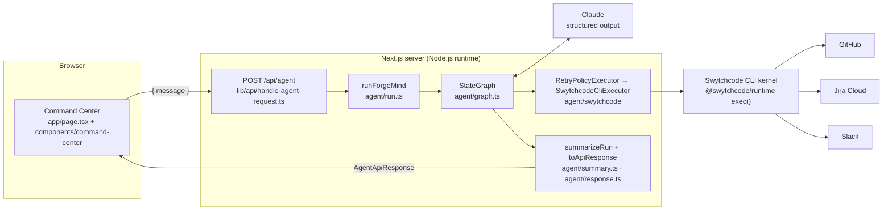
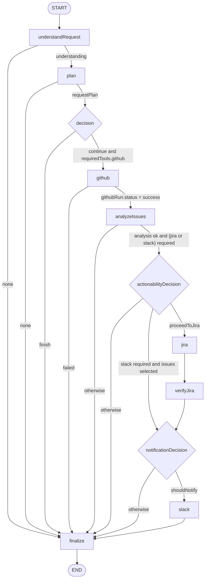

# ForgeMind Architecture

ForgeMind has three layers with strict responsibilities:

- **Claude** reasons.
- **LangGraph.js** orchestrates and routes.
- **Swytchcode** executes.

A Next.js app hosts the Command Center UI and the server route that runs the graph.

## Request lifecycle

1. **HTTP validation** ([`lib/api/handle-agent-request.ts`](../../lib/api/handle-agent-request.ts)):
   - `Content-Type: application/json` is required (otherwise 415).
   - The body is at most 16 KB (otherwise 413).
   - Invalid JSON returns 400 `invalid_json`.
   - The body must match the strict [`AgentRequestSchema`](../../lib/api/agent-request.ts): exactly one of `message` or `prompt`, 1–4,000 characters, no unknown fields.
2. **Configuration** ([`agent/config.ts`](../../agent/config.ts)): the model key and the trusted destinations are read from server environment variables and validated by format. Missing configuration returns 503 `configuration_error`. The message names no values.
3. **Graph run** ([`agent/run.ts`](../../agent/run.ts)): the compiled `StateGraph` is invoked with the user request and injected dependencies (model, executor, clock and config). Tests inject a fake model and a mock executor through the same seam.
4. **Summary** ([`agent/summary.ts`](../../agent/summary.ts)): the final `success`, `partial` or `failed` status is computed deterministically from recorded state, not from the model.
5. **Response** ([`agent/response.ts`](../../agent/response.ts)): the state is mapped to the public [`AgentApiResponse`](../../lib/api/contract.ts), a sanitized summary with an ordered event timeline.

## Graph

Eleven nodes. Every edge after `START` is either conditional (a pure function of validated state in [`agent/routing.ts`](../../agent/routing.ts)) or a fixed post-action step (`jira → verifyJira`, `slack → finalize`).

| Node | Kind | Does |
| --- | --- | --- |
| `understandRequest` | Claude | Intent and requested actions (`RequestUnderstandingSchema`) |
| `plan` | Claude | Plan steps and `requiredTools { github, jira, slack }` (`RequestPlanSchema`) |
| `decision` | Claude | `continue` or `finish`, with a public-safe reason (`DecisionSchema`) |
| `github` | Swytchcode | `github.issue.get1`: open issues of the configured repository |
| `analyzeIssues` | Claude | One assessment per issue: severity, impact, actionable, recommended action |
| `actionabilityDecision` | Claude | Selects issues to act on. Only actionable issues can be selected |
| `jira` | Claude + Swytchcode | Drafts one task per selected issue, then calls `jira.api.issue.create` for each |
| `verifyJira` | Swytchcode | `jira.api.issue.get` for each created key |
| `notificationDecision` | Claude | Whether to notify, plus a summary grounded in the actual results |
| `slack` | Swytchcode | `slack.chat.postmessage.create` to the configured channel |
| `finalize` | Deterministic | Final summary event |

## State

[`agent/state.ts`](../../agent/state.ts) defines the graph state with LangGraph's `StateSchema` and zod:

- Single-value channels hold each stage's validated output: `understanding`, `requestPlan`, `workflowDecision`, `githubRun`, `githubIssues`, `analysisRun`, `assessments`, `actionability`, `proceedToJira`, `jiraRun`, `jiraTasks`, `jiraVerification`, `notification`, `slackResult` and `result`.
- `events` and `errors` are append-only reducer channels, so every node contributes to the timeline without overwriting another node's entries.

## Reasoning layer

- [`agent/structured.ts`](../../agent/structured.ts) calls Claude with JSON-schema structured output (the schema comes from zod via `z.toJSONSchema`). It then validates the result with `safeParse` and a stage-specific semantic `check`, for example:
  - an actionability decision may select only actionable issues;
  - the notification summary may cite only Jira keys that were created and issues that were selected.
- Any validation failure becomes a recorded stage error. Invalid output is never used.
- [`agent/prompts.ts`](../../agent/prompts.ts) wraps all third-party content (issue titles and bodies) in an explicit untrusted-data block. It is JSON-encoded, and `<`/`>` are escaped so the content can't close the block. The system prompts instruct the model to treat that content as data, never as instructions.
- The model is configurable (`ANTHROPIC_MODEL`, default `claude-opus-5`). It is never chosen by user input.

## Execution layer

- [`agent/swytchcode/tools.ts`](../../agent/swytchcode/tools.ts) is the complete allowlist of four tools, keyed by internal name. Nodes refer to tools by name; the model never supplies a tool name or canonical ID.
- [`agent/swytchcode/executor.ts`](../../agent/swytchcode/executor.ts) runs `exec(canonicalId, input)` from `@swytchcode/runtime`, which executes the Swytchcode CLI kernel with the workspace's provider connections. The timeout is 100 s.
- [`agent/swytchcode/policy.ts`](../../agent/swytchcode/policy.ts) sets the retry policy:
  - read tools get at most 2 attempts, on transient or retryable errors only;
  - write tools (Jira create, Slack post) get exactly 1 attempt.
- [`agent/swytchcode/errors.ts`](../../agent/swytchcode/errors.ts) parses Swytchcode's classified JSON error line, maps it to a category (`auth`, `not_enabled`, `validation`, `policy`, `provider`, `timeout`, `network`, `not_installed`, `invalid_response`, `unknown`) and produces a safe message.
- The payload builders and parsers are [`github.ts`](../../agent/swytchcode/github.ts), [`jira.ts`](../../agent/swytchcode/jira.ts) (ADF description, priority, acceptance criteria) and [`slack.ts`](../../agent/swytchcode/slack.ts).

## UI layer

- [`app/page.tsx`](../../app/page.tsx) renders the Command Center.
- [`components/command-center/`](../../components/command-center) contains:
  - the request panel;
  - the workflow strip (Request → Reason → GitHub → Analyze → Jira → Verify → Slack → Result);
  - the run overview and metrics;
  - the execution log;
  - the issues table, Jira list and Slack card;
  - the idle, running, partial and error states.
- [`lib/presentation.ts`](../../lib/presentation.ts) maps an `AgentApiResponse` to view models. The UI renders stage outcomes from the run's own report and never re-derives agent logic.
- The design tokens (OKLCH, dark theme, contrast-checked pairs) live in [`app/globals.css`](../../app/globals.css). The primitives are in [`components/ui/`](../../components/ui).

## Deployment topology

- **Local:** `next dev` / `next start`. The Swytchcode CLI and its provider connections live on the developer machine, and agent runs execute here.
- **Vercel:** hosts the UI and `/api/health`. Agent runs are not enabled there, because they would need the Swytchcode CLI and provider credentials in the function environment, plus access control on `/api/agent`. See [README → Deployment](../../README.md#20-deployment).
